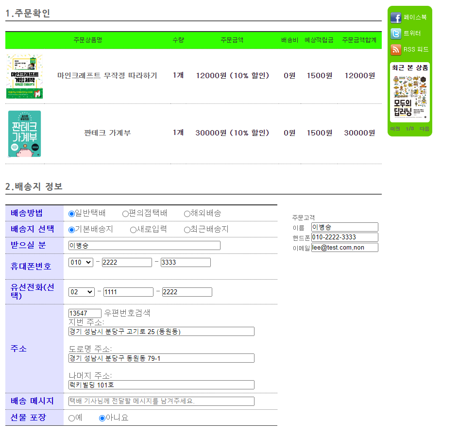

# BookTopia

 도서 쇼핑몰 / 첫 프로젝트
 <자바 웹을 다루는 기술>을 참고한 클론 프로젝트
 - OOP를 기반으로 DB설계 및 객체를 기능별로 나누어 기획
 - RESTFul을 바탕으로 코드 작성

# 서비스 사진

서비스 사진

- ### 메인 화면

- ### 관리자 로그인 시 상단 메뉴

- ### 회원 로그인 시 상단 메뉴

- ### 회원 마이 페이지

- ### 관리자 페이지

- ### 자동 완성 기능 

- ### 장바구니

- ### 주문 기능

# 기획 설계

- ## 사전 설계

- ## ERD
